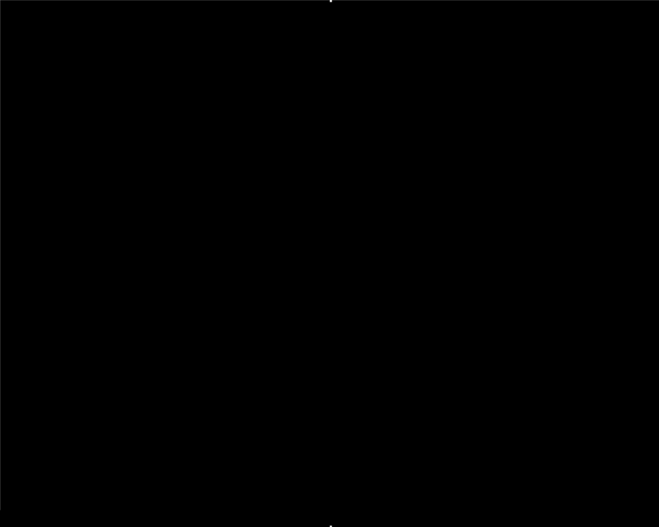

# BresenhamsCircle 6502
## Bresenham's Circle, implemented in BASIC and 6502 Assembly

Bresenham's circle algorithm on the Acorn Electron, first in BBC BASIC and then in 6502 assembler. The assembler versions skip the operating system and write pixels straight into screen memory. The same circle goes from 13.8 seconds in BASIC to under 0.05 seconds.

### Versions

Each version is its own program, so they can be compared side by side. **Play** opens it in [Electroniq](https://github.com/0xC0DE6502/electroniq), an Acorn Electron emulator that runs in the browser. `TIME` is in centiseconds for one radius 127 circle on Electroniq, averaged over 50 circles for the two fastest.

| Program | What it shows | MODE | `TIME` (cs) | Run it |
|---|---|---|---|---|
| [circle.bas](./circle.bas) | The original BASIC, using `PLOT` in graphics units | 1 | 1382 | [](https://0xc0de6502.github.io/electroniq/?dfs&autoboot&disk0=https://raw.githubusercontent.com/danieldownes/BresenhamsCircle_6502/main/disks/circle.ssd) |
| [circle_pixel.bas](./circle_pixel.bas) | BASIC, textbook form in whole pixels | 1 | 1555 | [](https://0xc0de6502.github.io/electroniq/?dfs&autoboot&disk0=https://raw.githubusercontent.com/danieldownes/BresenhamsCircle_6502/main/disks/circle_pixel.ssd) |
| [circle_asm.bas](./circle_asm.bas) | First 6502 version: writes screen memory directly | 1 | 21 | [](https://0xc0de6502.github.io/electroniq/?dfs&autoboot&disk0=https://raw.githubusercontent.com/danieldownes/BresenhamsCircle_6502/main/disks/circle_asm.ssd) |
| [circle_asm_fast.bas](./circle_asm_fast.bas) | 6502 with lookup tables, two pixels per row | 1 | 9.9 | [](https://0xc0de6502.github.io/electroniq/?dfs&autoboot&disk0=https://raw.githubusercontent.com/danieldownes/BresenhamsCircle_6502/main/disks/circle_asm_fast.ssd) |
| [circle_asm_mode5.bas](./circle_asm_mode5.bas) | Same code as `circle_asm_fast`, in MODE 5 | 5 | 4.7 | [](https://0xc0de6502.github.io/electroniq/?dfs&autoboot&disk0=https://raw.githubusercontent.com/danieldownes/BresenhamsCircle_6502/main/disks/circle_asm_mode5.ssd) |
| [circle_asm_mode4.bas](./circle_asm_mode4.bas) | Same code in MODE 4, the version the stepper page runs | 4 | 5 | [](https://0xc0de6502.github.io/electroniq/?dfs&autoboot&disk0=https://raw.githubusercontent.com/danieldownes/BresenhamsCircle_6502/main/disks/circle_asm_mode4.ssd) |
| [circle_rainbow.bas](./circle_rainbow.bas) | Every radius from 127 to 1 in 7 colours: a filled disc | 2 | 958 for 127 circles | [](https://0xc0de6502.github.io/electroniq/?dfs&autoboot&disk0=https://raw.githubusercontent.com/danieldownes/BresenhamsCircle_6502/main/disks/circle_rainbow.ssd) |
| [circle_pulse.bas](./circle_pulse.bas) | Every 2nd radius, then palette cycling one colour at a time | 2 | 502, then animates | [](https://0xc0de6502.github.io/electroniq/?dfs&autoboot&disk0=https://raw.githubusercontent.com/danieldownes/BresenhamsCircle_6502/main/disks/circle_pulse.ssd) |

The versions that use lookup tables pause for a few seconds before drawing while BASIC builds the tables. In `circle_pulse`, press ESCAPE to stop the animation.

### Step through the code

[Electron Circle Stepper](https://danieldownes.github.io/BresenhamsCircle_6502/docs/electron-circle-stepper.html) is an interactive page that runs the machine code from `circle_asm_mode4.bas` in a small 6502 emulator, one instruction at a time. It explains each instruction in plain English, groups the code into blocks that say what each part does, and shows the registers, the zero page variables, how each pixel's screen address is built, and the MODE 4 screen as the circle appears. You can step forwards and backwards, jump to the next pixel or the next loop, or run it at different speeds.

**[Open the Electron Circle Stepper](https://danieldownes.github.io/BresenhamsCircle_6502/docs/electron-circle-stepper.html)**. It is a single HTML file, [docs/electron-circle-stepper.html](./docs/electron-circle-stepper.html), served by GitHub Pages, so it also works when downloaded and opened locally.


### BASIC Version



Tested on ElectrEm and ElkJS emulators.
The included snapshot.uef file can also be loaded with these emulators.

```basic
10 GOTO 240  
20 DEF PROCcirc(xc,yc,x,y)  
30 PLOT69,xc+x,yc+y  
40 PLOT69,xc-x,yc+y  
50 PLOT69,xc+x,yc-y  
60 PLOT69,xc-x,yc-y  
70 PLOT69,xc+y,yc+x  
80 PLOT69,xc-y,yc+x  
90 PLOT69,xc+y,yc-x  
100 PLOT69,xc-y,yc-x  
110 ENDPROC  
120 DEF PROCBres(xc,yc,r,s)  
130 LOCAL x,y,d  
140 x=0  
150 y=r  
160 d=3-2*r  
170 PROCcirc(xc,yc,x,y)  
180 REPEAT  
190 x=x+s  
200 IF d>=0 THEN y=y-s:d=d+4*(x-y)+10 ELSE d=d+4*x+6  
210 PROCcirc(xc,yc,x,y)  
220 UNTIL y <= x  
230 ENDPROC  
240 MODE1  
250 TIME=0  
260 PROCBres(640,512,510,4)  
270 PRINT TIME  
```


### BASIC Version (textbook form)

[circle_pixel.bas](./circle_pixel.bas) is an alternative that follows the textbook (Michener) form of the algorithm exactly:

- Works in pixel units (MODE 1 is 320x256, so r=127 about a centre of 160,128) and only scales by 4 to graphics units when plotting.
- Updates `d` using the current `x` and `y`, before stepping them.
- Tests `d<0`, and stops as soon as `x>y`, so no points are drawn past the 45° diagonal.

This is closer to what the 6502 version will do, where each step is one pixel and `4*x` is two shifts.

On Electroniq it prints a `TIME` of 1555, against 1382 for the version above. The extra time is mainly the four `4*` scalings per step, which BASIC does in floating point because the variables are not integer (`%`) variables.


### 6502 Assembly Version: first steps

Looking at the BASIC code, the main and most complex part is the IF statement and proceeding maths operations

Having almost no prior experience with 6502, other than some light accademic exposure, I first looked for a multiplication solution. I understood that there was no multiplication operation on the 6502 so proceeded to search for one.

The first to be found was:
https://www.lysator.liu.se/~nisse/misc/6502-mul.html#
and
https://codebase64.org/doku.php?id=base:8bit_multiplication_8bit_product

These were both 8bit*8bit=8bit solutions and no check had been done to check if a 16bit operation was needed at this time.

I proceeded to check this code, and thought it may be interesting to fine a more pure 6502 emulator than using the Acorn Electon version, mostly due to the issue of no supported copy and paste, and also the idea that it would be easier to display a memory dump.

I quickly found this JS based one:
https://skilldrick.github.io/easy6502/


In the case of the White Flame multiplication solution, it wasn't clear how to load num1 and num2 with values.

Looking through examples I saw you can define a value using:
`define varible_name #$05 

The variable would then be directly replaced with the direct value of '05'

However, this isn't sufficient and failed to produce the result.

Of course you need to use num1 and num2 as memory locations, which are more like the idea of a, "int member instance" in C# terminology.

The first example on easy6502 show how to load values into memory, so I simply defined mem1 and mem2 to memory locations, and then loaded the desired values to be multiplied into these locations.

```asm
define num1 $01
define num2 $02

LDA #$04
STA num1
LDA #$03
STA num2
```

It was observed that A=$0c as expected.


### From BASIC to 6502: how the assembly versions developed

The multiplication research above turned out not to be needed. The circle only ever multiplies by 2 or 4, and on a 6502 that is one or two `ASL` shifts. What the assembler does need is 16-bit arithmetic, done one byte at a time and passing the carry flag between the bytes, because the decision value goes below -128 and above 127.

Each step below became its own program:

1. **Work in whole pixels** (`circle_pixel.bas`). The original BASIC steps in graphics units, 4 per MODE 1 pixel. The textbook form of the algorithm works in whole pixels, so each step is +1 and each update is a small addition.
2. **Skip the OS and write screen memory** (`circle_asm.bas`). `PLOT` goes through the OS's graphics coordinate system for every pixel. Working out the screen address from the memory layout in the *Acorn Electron Advanced User Guide*, and setting the pixel's bits with `ORA`, is 74 times faster than the BASIC textbook version.
3. **Swap calculation for lookup tables** (`circle_asm_fast.bas`). BASIC builds tables of row addresses, column offsets and pixel masks before the `CALL`. Each pixel then needs two table reads and an add. This is about twice as fast again, with a third fewer instructions.
4. **Pick a screen mode the CPU can share** (`circle_asm_mode5.bas`, `circle_asm_mode4.bas`). In MODEs 0 to 3 the display locks the CPU out of RAM for most of each scan line. The identical code runs about twice as fast in MODE 5. MODE 4 keeps MODE 1's 320-pixel width with the same benefit, and is the clearest version to study.
5. **Effects** (`circle_rainbow.bas`, `circle_pulse.bas`). Drawing every radius in turn fills a disc with coloured rings. Changing the palette once per frame then animates it without redrawing anything.

Every version was run on Electroniq. Each assembler version was also checked pixel for pixel against the OS: the program redraws the same circle with `PLOT 69` in another colour, uses `POINT` to confirm every OS pixel was already set, and checks that no pixel set only by the assembler is left over.


### 6502 Assembly Version (direct screen memory)

[circle_asm.bas](./circle_asm.bas) uses BBC BASIC's built-in assembler to build a 6502 version of the textbook algorithm, then `CALL`s it. Instead of going through `PLOT` and the OS's graphics coordinate system, it writes pixels straight into MODE 1 screen memory.

Reference: *Acorn Electron Advanced User Guide*

- Appendix C (MODE 1 layout): 320x256 pixels, 4 colours, 2 bits per pixel, screen memory from `&3000`. Memory is laid out in character cells: 8 bytes going down one cell, then on to the next cell to the right.
- `&352`/`&353` (VDU workspace): 640 bytes per character row in 20K modes.
- `&362`/`&363` (left/right colour masks): the bits that belong to each pixel. In a 4 colour mode pixel 0 (leftmost) is bits 7 and 3, so the masks are `&88`, `&44`, `&22`, `&11`.
- Zero page: "BASIC reserves locations &70-&8F for the user", so all the routine's variables live there.

For pixel column `px` (0-319) and row `py` (0-255, from the top):

```
address = &3000 + (py DIV 8)*640 + (px DIV 4)*8 + (py MOD 8)
mask    = &88 >> (px MOD 4)
```

- `(py DIV 8)*640` comes from a 32-entry lookup table built in BASIC, so no multiply is needed.
- `(px DIV 4)*8` is `(px AND &FFFC)*2`: an `AND` and one 16-bit shift.
- `py MOD 8` goes in the `Y` register for `ORA (scr),Y` / `STA (scr),Y`.
- `ORA` sets both bits of the pixel (colour 3, white). Pixels drawn twice (at `x=0` and on the diagonal) come out the same.

The decision variable is signed 16 bit, because it starts at `3-2*127 = -251`. `4*t` is two `ASL`/`ROL` pairs. `x` and `y` fit in 8 bits, but `cx+y` can reach 287, so the pixel column is 16 bit.

It prints a `TIME` of 21 (0.21 seconds), against 1555 for the BASIC textbook version. It draws exactly the same pixels as `PLOT 69`: redrawing the circle with `PLOT` in another colour and checking every point with `POINT` found no missing or extra pixels.


### 6502 Assembly Version (faster)

[circle_asm_fast.bas](./circle_asm_fast.bas) draws the same pixels as `circle_asm.bas` about twice as fast, with a third fewer instructions (81 against 120):

- **Lookup tables built in BASIC before the `CALL`.** A 256-entry table gives the full screen address of every pixel row, including `row MOD 8`. Six 128-entry tables give the byte offset and pixel mask for `cx+u` and `cx-u`, where `u` is the distance from the centre. Every lookup is indexed by an 8-bit register, so the 16-bit pixel-column maths, `LSR`s and `AND`s are gone.
- **Two pixels per row.** `(cx+u, row)` and `(cx-u, row)` share a row, so `row2` looks the row up once and sets both pixels. Each step calls it four times, for rows `cy+-y` and `cy+-x`.
- **Halved decision variable.** `d` is always odd, so `D = (d-1)/2` makes exactly the same decisions. It starts at `1-r` and its steps are `2x+3`, or `2x+5` then `-2y`. Each of those fits in a byte and is added or subtracted directly, with no shifted 16-bit temporary. `D` itself still needs 16 bits, since for r=127 it ranges from -210 to 171.

Drawing the circle 50 times on Electroniq:

| Version | `TIME` for 50 circles | Per circle |
|---|---|---|
| `circle_asm.bas` | 1061 | 21.2 cs |
| `circle_asm_fast.bas` | 495 | 9.9 cs |

The cost is about 1.3 KB of tables, and a pause of several seconds before drawing while BASIC builds them. The tables depend on the centre, so they must be rebuilt if `xc` changes, and the radius is limited to 127. The same `POINT` check found no missing or extra pixels compared with `PLOT 69`.

In MODE 1 the code and tables are in RAM, which the display holds for "40 µs out of 64 µs in 256 lines out of 312" (Advanced User Guide, section 15.3). So much of the remaining time is the CPU waiting. A 10K mode such as MODE 4 or 5 should be faster, but needs a different address calculation.


### 6502 Assembly Version (MODE 5)

[circle_asm_mode5.bas](./circle_asm_mode5.bas) runs exactly the same assembly code as `circle_asm_fast.bas`. Only the lookup tables change, to suit the MODE 5 screen (Advanced User Guide, Appendix C):

| | MODE 1 | MODE 5 |
|---|---|---|
| Pixels | 320x256 | 160x256 |
| Screen memory | `&3000` | `&5800` |
| Bytes per character row | 640 | 320 |
| Pixel byte format | 4 pixels, 2 bits each | same, masks `&88` `&44` `&22` `&11` |

MODE 5 pixels are twice as wide as they are tall. A circle worked out directly in 160x256 pixels would be drawn as a 2:1 ellipse. So, like the OS's own `PLOT`, it works the circle out on the same 320x256 grid as MODE 1 and stores column `x DIV 2` in the tables. `PRINT ;TIME` prints the time without padding, because MODE 5 has only 20 text columns and the padded number would overwrite the top of the circle.

The reason for trying it: in MODE 1 the display takes the RAM for "40 µs out of 64 µs in 256 lines out of 312", so the CPU waits whenever it needs RAM. In MODE 4 to 6 it only has to slow to 1 MHz for RAM (section 15.3). The code, tables and zero page variables are all in RAM, so every instruction pays that cost.

Drawing the circle 50 times on Electroniq:

| Version | `TIME` for 50 circles | Per circle |
|---|---|---|
| `circle_asm.bas` (MODE 1) | 1061 | 21.2 cs |
| `circle_asm_fast.bas` (MODE 1) | 495 | 9.9 cs |
| `circle_asm_mode5.bas` (MODE 5) | 233 | 4.7 cs |

The code is identical, so the 2.1x gain over MODE 1 is entirely down to memory contention. That depends on how accurately Electroniq emulates the ULA, which its own README describes as a work in progress. A real Electron may differ. The `POINT` check against `PLOT 69` in MODE 5 found no missing or extra pixels.


### 6502 Assembly Version (MODE 4)

[circle_asm_mode4.bas](./circle_asm_mode4.bas) is the same code again for MODE 4: 320x256 in 2 colours, screen memory from `&5800`, 320 bytes per character row (Advanced User Guide, Appendix C). Each byte holds 8 pixels, one bit each, so the masks are `&80` down to `&01` and a column's byte offset is `(px DIV 8)*8`. MODE 4 pixels are the same size as MODE 1's, so no `DIV 2` is needed. It prints a `TIME` of 5 for one circle. The `POINT` check against `PLOT 69` found no missing pixels, and erasing every `PLOT` point in black left no extra ones.

This is the version the [Electron Circle Stepper](#step-through-the-code) runs, one instruction at a time.


### Filled rainbow circle (MODE 2)

[circle_rainbow.bas](./circle_rainbow.bas) draws the circle at every radius from 127 down to 1, each in the next of the 7 MODE 2 colours, then plots the centre pixel. The result is a filled disc of coloured rings.

Concentric Bresenham circles do not normally fill a disc. On MODE 1's 320-wide grid, radii 1 to 127 leave 5,052 of the 50,617 pixels in the disc unset (about 10%), mostly near the diagonals. MODE 2 and MODE 5 pixels are two grid columns wide, so each screen pixel is hit by either of two neighbouring grid points. That closes every gap: 0 holes out of 25,436 pixels (checked by simulation, and no black pixels are visible inside the disc on Electroniq).

Changes from `circle_asm_mode5.bas`:

- **MODE 2 layout** (Advanced User Guide, Appendix C): screen memory from `&3000`, 640 bytes per character row, 2 pixels per byte. The pixel masks are `&AA` (left) and `&55` (right), the 16 colour masks given for `&362`/`&363`.
- **Colour.** `ORA` can only set bits, which works for white but not for writing a colour over another. Each pixel is written as `old EOR ((old EOR col) AND mask)`, which replaces only that pixel's bits with the colour.
- **Colour byte from the OS.** After `GCOL 0,c` the OS keeps the foreground graphics colour at `&359`, "stored as the value that would be stored in a byte in screen memory to completely colour that byte". BASIC copies it to `col` before each `CALL`.
- **Radius 0 is not passed to the routine.** With r=0, `y` would drop from 0 to 255 and the loop would not stop, so the centre pixel is drawn with `PLOT 69` instead.

It prints a `TIME` of 958 for all 127 circles on Electroniq. That includes the BASIC loop and `GCOL` for each circle. MODE 2 is a 20K mode like MODE 1, so the CPU waits for RAM while the display is being drawn.


### Pulsing rings (palette cycling)

[circle_pulse.bas](./circle_pulse.bas) draws concentric rainbow circles, then shows only one of the 7 colours at a time, stepping to the next colour every frame. Only rings of the current colour are lit, so the rings appear to ripple across the disc. Press ESCAPE to stop, and `VDU 20` puts the normal colours back.

It draws every 2nd radius (127, 125, ... 1), not every radius like `circle_rainbow.bas`. A MODE 2 pixel is 2 grid units wide, so with every radius, neighbouring circles often land in the same screen column and the smaller one overwrites the larger. That breaks each ring into dashes near the left and right edges. Stepping by 2 makes each circle exactly 1 pixel wider than the next. Figures from simulating the drawing on the MODE 2 grid:

| Radii drawn | Pixel writes | Overwritten | Holes in the disc |
|---|---|---|---|
| Every radius (`circle_rainbow.bas`) | 39,245 | 13,603 (35%) | 0 |
| Every 2nd radius (`circle_pulse.bas`) | 19,776 | 0 | 5,866 (23%) |

A step of 1 pixel across is a step of 2 rows up and down, so small gaps appear between rings near the diagonals. While pulsing only one colour is lit, so the gaps do not show and each ring is a complete circle. Drawing takes half as long: a `TIME` of 502, against 958.

Nothing is redrawn. Each ring's pixels keep their logical colour, and only the palette changes, i.e. which physical colour each logical colour shows as. Each step changes just two palette entries: the current colour is set to black, and the next one to its own physical colour.

- **OSBYTE &13, "Wait for vertical sync"**, waits for the start of the next frame, 50 times a second.
- **OSWORD &C, "Write palette"**, sets one palette entry from a 5-byte block in zero page (`blk`: logical colour, physical colour, then three zeros). The Advanced User Guide describes it as doing the same as `VDU 19` "with a significant saving in time", and it keeps the OS copy of the palette at `&36F` up to date.
- **ESCAPE** sets bit 7 of `&FF`, so `BIT &FF : BPL pulse` loops until it is pressed. OSBYTE &7E then acknowledges it, so BASIC does not report an "Escape" error.

One step per frame (50 steps a second, so all 7 colours about 7 times a second) is as fast as it can go while still showing a single colour. If the palette changed part-way through a frame, the top of the screen would show one colour and the bottom another. Writing the ULA palette registers at `&FE08`-`&FE0F` directly would be quicker than OSWORD &C, but would not make more than one clean step per frame possible.

The printed `TIME` uses logical colour 7 for text, so it only shows during the white step.


### Running the programs yourself

The **Play** buttons load a disk image from [disks](./disks) into Electroniq. Its `dfs` option adds a disk filing system and `autoboot` boots the disk.

Each disk holds one file, `!BOOT`, containing the BASIC program as text followed by `RUN`, with boot option 3 (`*EXEC`). Booting reads the file as if it were typed, but at disk speed, so no BASIC tokeniser is needed. After changing a program, rebuild its disk with:

```
python tools/make_ssd.py circle_asm_mode4.bas disks/circle_asm_mode4.ssd
```

The disks also work in other Electron emulators with a disk interface, using SHIFT+BREAK to boot. Electroniq's licence allows personal and educational use but not redistribution, so it is linked rather than included here.
